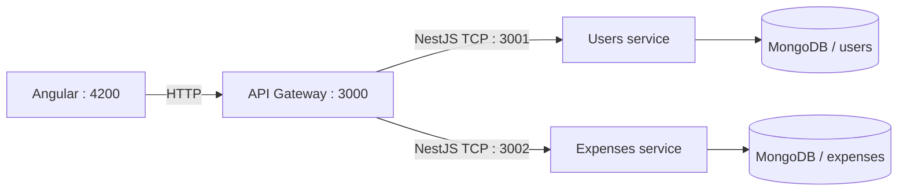

<h1 align="center">💸 Expense Tracker Microservices</h1>

<p align="center">
  Une application pédagogique de suivi des dépenses construite autour d'une API Gateway et de microservices NestJS.
</p>

<p align="center">
  
  
  
  
  
</p>

## À propos

Ce projet explore la séparation d'une application métier en services indépendants. Une API Gateway HTTP transmet les commandes aux services utilisateurs et dépenses grâce au transport TCP de NestJS. L'interface Angular fournit les écrans d'authentification, de tableau de bord et de saisie des dépenses.

## Architecture



## Fonctionnalités présentes

- inscription et connexion avec mots de passe hachés par bcrypt ;
- émission et vérification de jetons JWT ;
- consultation du profil authentifié ;
- création et consultation des dépenses de l'utilisateur connecté ;
- tableaux et graphiques Angular de démonstration ;
- séparation API Gateway, utilisateurs et dépenses.

## Lancer le projet en local

### Prérequis

- Node.js 20 ou version ultérieure ;
- npm 10 ou version ultérieure ;
- Docker uniquement pour lancer MongoDB facilement.

```bash
git clone https://github.com/christophersemard/expense-tracker-microservices.git
cd expense-tracker-microservices
cp .env.example .env
npm run install:all
docker compose up -d mongodb
```

Remplacer impérativement `JWT_SECRET` dans `.env`, puis lancer chaque processus dans un terminal séparé :

```bash
npm run start:dev --prefix users-service
npm run start:dev --prefix expenses-service
npm run start:dev --prefix api-gateway
npm start --prefix frontend
```

L'interface est accessible sur `http://localhost:4200` et l'API Gateway sur `http://localhost:3000`.

## Routes principales

| Méthode | Route | Description |
|---|---|---|
| `POST` | `/auth/register` | Créer un utilisateur |
| `POST` | `/auth/login` | Obtenir un JWT |
| `GET` | `/auth/profile` | Lire le profil authentifié |
| `GET` | `/expenses` | Lister ses dépenses |
| `POST` | `/expenses` | Créer une dépense |

Les trois dernières opérations attendent un header `Authorization: Bearer <token>`.

## Vérifications

```bash
npm test
npm run build
```

## Limites connues

- Il s'agit d'un prototype pédagogique, sans mécanisme de renouvellement ou révocation des JWT.
- L'interface conserve le JWT dans `localStorage`, choix simple mais moins robuste qu'un cookie sécurisé `HttpOnly`.
- La modification et la suppression d'une dépense ne sont pas encore exposées par l'API Gateway.
- Les graphiques Angular reposent encore en partie sur des données de démonstration.

> Projet mis en avant dans la vitrine GitHub ; documentation revue en août 2026.

## Auteur

Projet réalisé par [Christopher Semard](https://github.com/christophersemard) dans le cadre de sa formation en développement full-stack.
